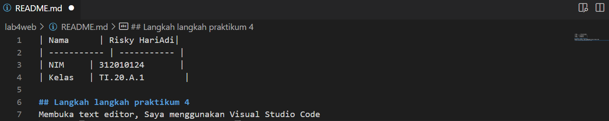

| Nama      | Risky HariAdi|
| ----------- | ----------- |
| NIM     | 312010124       |
| Kelas   | TI.20.A.1        |

## Langkah langkah praktikum 4
Membuka text editor, Saya menggunakan Visual Studio Code

## 1. Membuat Box Element
Tambahkan kode untuk membuat box element dengan tag div seperti berikut.

## 2. CSS Float Property
Selanjutnya tambahkan deklarasi CSS pada head untuk membuat float element, seperti berikut,
Kemudian buka browser untuk melihat hasilnya.

## Hasilnya 

## 3. Mengatur Clearfix Element
Clearfix digunakan untuk mengatur element setelah float element. Property clear digunakan untuk mengaturnya.

Tambahkan element div lainnya seteleah div3 seperti berikut.

Kemudian atur property clear pada CSS, seperti berikut.

Selanjutnya buka browser dan refresh kembali.

## 4. Membuat Layout Sederhana
Kita akan membuat layout web sederhana seperti gambar berikut. (tertera di modul praktikum)

Buat folder baru dengan nama lab4_layout, kemudian buatlah file baru didalamnya dengan nama home.html, dan file css dengan nama style.css

Kemudian tulis kode berikut, Lalu buka browser dan lihat hasilnya.

Kemudian tambahkan kode CSS untuk membuat layoutnya.

## 5. Membuat Navigasi
Kemudian selanjutnya mengatur navigasi, Lalu lihat hasilnya.

## 6. Membuat Hero Panel
Selanjutnya membuat hero panel. Tambahkan kode HTML dan CSS seperti berikut.

Kemudian lihat hasilnya.

## 7. Mengatur Layout Main dan Sidebar
Selanjutnya mengatur main content dan sidebar, tambahkan CSS float.

## 8. Membuat Sidebar Widget
Kemudian selanjutnya menambahkan element lain dalam sidebar.

Kemudian tambahkan CSS

Lalu lihat hasilnya

## 9. Mengatur Footer
Selanjutnya mengatur tampilan footer. Tambahkan CSS untuk footer & Lihat hasilnya

## 10. Menambahkan Elemen lainnya pada Main Content

Kemudian tambahkan CSS.

Lalu lihat hasilnya

## 11. Menambahkan Content Artikel

Kemudian tambahkan CSS.

Lalu lihat hasilnya

## Pertanyaan dan Tugas
1. Tambahkan Layout untuk menu About
=> buat single layout yang berisi deskripsi, portfolio, dll
2. Tambahkan layout untuk menu Contact
=> yang berisi form isian: nama, email, message, dll

## Jawab
## 1. Buat html seperti berikut

Kemudian tambahkan CSS.

Lalu lihat hasilnya

## 2. Buat html seperti berikut

Kemudian tambahkan CSS.

Lalu lihat hasilnya

